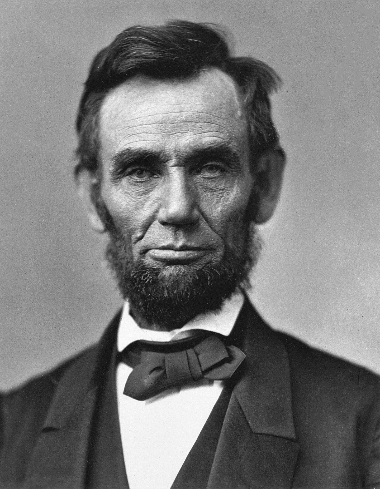
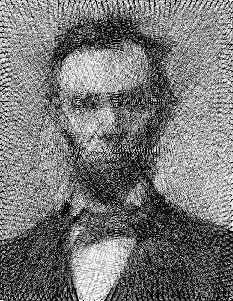
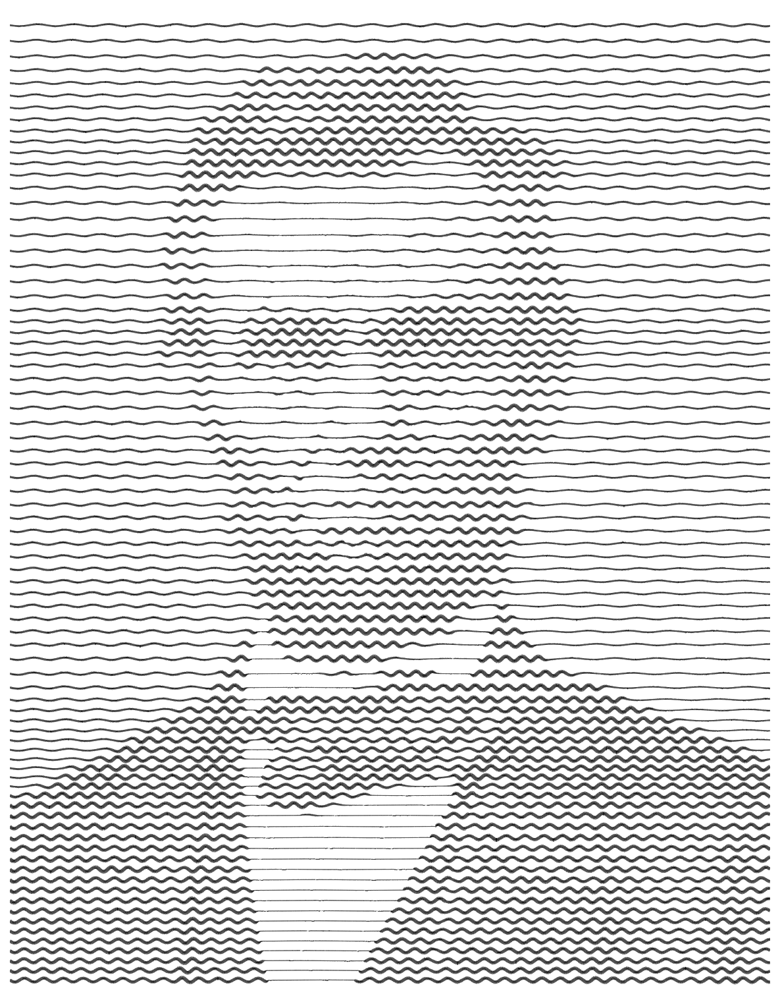

# DigitalArt

Algorithmic art generators that transform photographs into stylized artwork using Python.

## Gallery

| Original | Line Art | Squiggly Art |
|:--------:|:--------:|:------------:|
|  |  |  |

## How It Works

### Line Art (`Line_art.py`)

Builds an image by iteratively drawing straight lines between random points on the
image border. At each step the algorithm evaluates candidate lines against the target
image and keeps the darkest and lightest matches, gradually converging on a
recognisable likeness made entirely of overlapping lines.

### Squiggly Art (`Squiggly_art.py`)

Converts an image into a series of horizontal wavy lines. The amplitude and thickness
of each wave is modulated by the local luminance of the source image, producing a
hand-drawn, engraving-style effect.

## Getting Started

### Prerequisites

- Python 3.8+

### Installation

```bash
git clone https://github.com/Aburomoh/DigitalArt.git
cd DigitalArt
pip install -r requirements.txt
```

### Usage

**Line Art**

```bash
python Line_art.py <input_image> <output_file> [--iterations N]
```

| Argument | Description | Default |
|----------|-------------|---------|
| `input_image` | Path to the source image | *required* |
| `output_file` | Path for the generated artwork | *required* |
| `--iterations` | Number of line-drawing iterations | `5000` |

Example:

```bash
python Line_art.py examples/Abraham_Lincoln.jpg output.png --iterations 10000
```

**Squiggly Art**

```bash
python Squiggly_art.py <input_image> <output_file> [--lines N] [--frequency F]
```

| Argument | Description | Default |
|----------|-------------|---------|
| `input_image` | Path to the source image | *required* |
| `output_file` | Path for the generated artwork | *required* |
| `--lines` | Number of horizontal lines | `40` |
| `--frequency` | Frequency of the wave pattern | `0.15` |

Example:

```bash
python Squiggly_art.py examples/Abraham_Lincoln.jpg squiggly_output.png --lines 50 --frequency 0.2
```

## Project Structure

```
DigitalArt/
├── examples/            # Sample input and output images
├── Line_art.py          # Line-based art generator
├── Squiggly_art.py      # Wavy line art generator
├── test_line_art.py     # Unit tests
├── requirements.txt     # Python dependencies
├── LICENSE
└── README.md
```

## License

This project is released into the public domain under [CC0 1.0](LICENSE).
